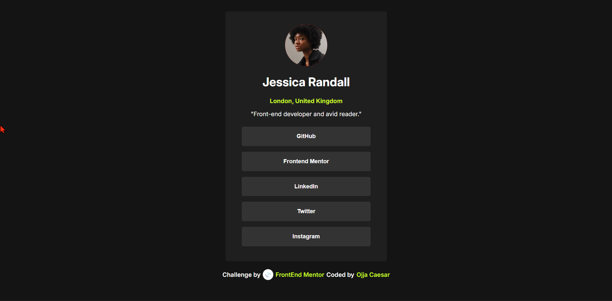
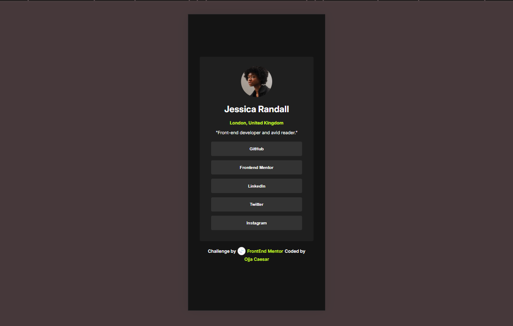
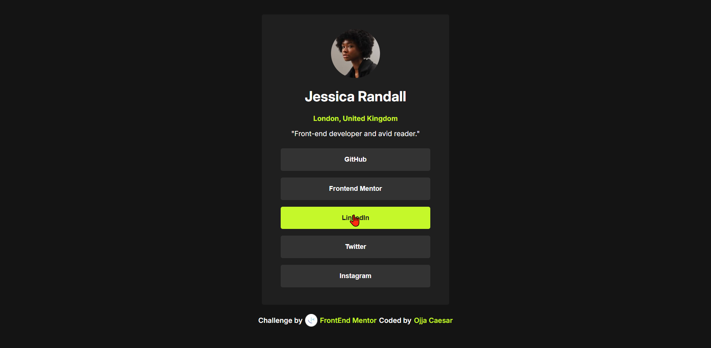
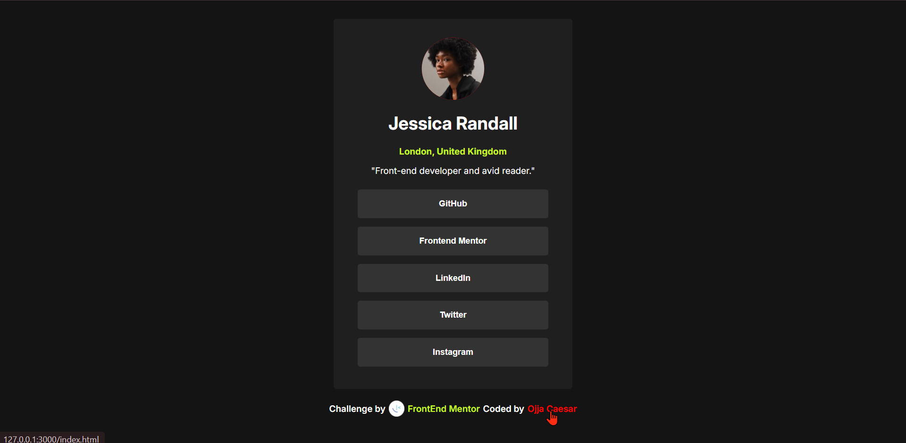

# Frontend Mentor - Social links profile solution

This is a solution to the [Social links profile challenge on Frontend Mentor](https://www.frontendmentor.io/challenges/social-links-profile-UG32l9m6dQ). Frontend Mentor challenges help you improve your coding skills by building realistic projects.

## Table of contents

- [Frontend Mentor - Social links profile solution](#frontend-mentor---social-links-profile-solution)
  - [Table of contents](#table-of-contents)
  - [Overview](#overview)
    - [The challenge](#the-challenge)
    - [Screenshot](#screenshot)
    - [Links](#links)
  - [My process](#my-process)
    - [Built with](#built-with)
    - [What I learned](#what-i-learned)
    - [Continued development](#continued-development)
    - [Useful resources](#useful-resources)
  - [Author](#author)

## Overview

### The challenge

Users should be able to:

- See hover and focus states for all interactive elements on the page

### Screenshot






### Links

- Solution URL: [View the source Code](https://github.com/jidoG8/SOCIAL-LINK-PROFILE.git)
- Live Site URL: [View the live project in action](https://jidog8.github.io/SOCIAL-LINK-PROFILE/)

## My process

### Built with

- Semantic HTML5 markup
- CSS custom properties
- Flexbox
- CSS Grid
- Mobile-first workflow
-

### What I learned

I have a gained little grasb on how to design the mobile first approach to a responsive design.

Below is some code im proud of:

```css
body {
	font-size: 14px;
	font-family: var(--font-family);
	background-color: var(--grey-900);
	color: white;
	min-height: 100vh;
	display: flex;
	justify-content: center;
	align-items: center;
	flex-direction: column;
	margin: 0;
	padding: 1rem;
}
```

```css
width: 90%;
max-width: 375px;
```

### Continued development

**Areas to improve:**

- **Advanced Media Queries** - Need to practice more complex breakpoint strategies and container queries
- **CSS Grid** - Want to explore grid layouts for more complex card arrangements
- **Hover/Focus States** - Need to add interactive states for better accessibility
- **Typography Scale** - Learn to create more systematic font sizing across breakpoints
- **Performance** - Optimize font loading and reduce CSS redundancy
- **Accessibility** - Improve semantic HTML and ARIA attributesreplace with your own plans for continued development.\*\*

### Useful resources

- [Manage Fonts in Windows](https://support.microsoft.com/en-us/windows/manage-fonts-in-windows-f12d0657-2fc8-7613-c76f-88d043b334b8/) This resource has shown me how to install the given Fonts for the design of this project.

## Author

- Frontend Mentor - [@OjjaCaesar](https://www.frontendmentor.io/profile/jidoG8)
- Linkedin- [@ojja-caesar](www.linkedin.com/in/ojja-caesar-134980345)
